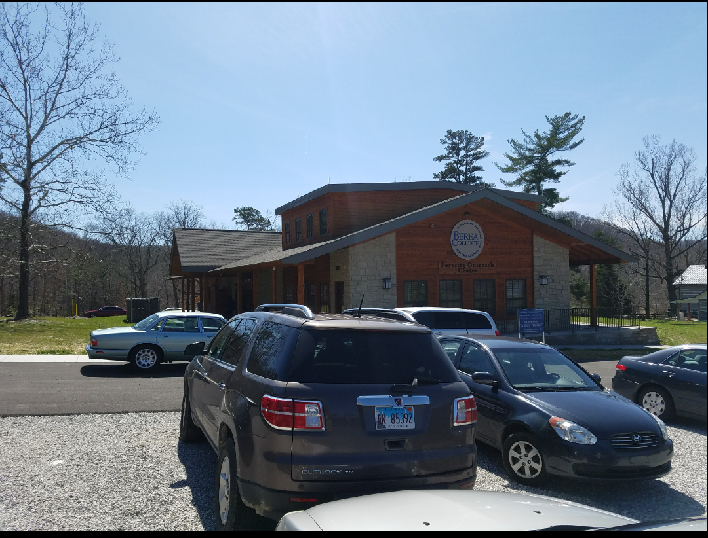

# Bluegrass

Maps of Kentucky and the beautiful Bluegrass Region

* [Kentucky Waterways](waterways)
* [Bluegrass counties population density](pop_density)
* [Springs of the Bluegrass](springs)
* Custom maps of Indian Fort Mountain
  * [Version made with QGIS](ifmtn/map)
  * [Version made with MapBOX](ifmtn)

  * Where you can use the restroom and get some information.

  * Bradley's getting a little tired.

  * No leaves on the tree's, early spring is such a great time to visit Indian Fort Mountain. "No Canopy No Problem".

  * Just in-case you get lost. P.S. that walking stick I'm using is from a bin that let's you borrow a walking stick.

  * Group pic from the lookout.

  * 10/10 I would go back and use the selfie stick again.

